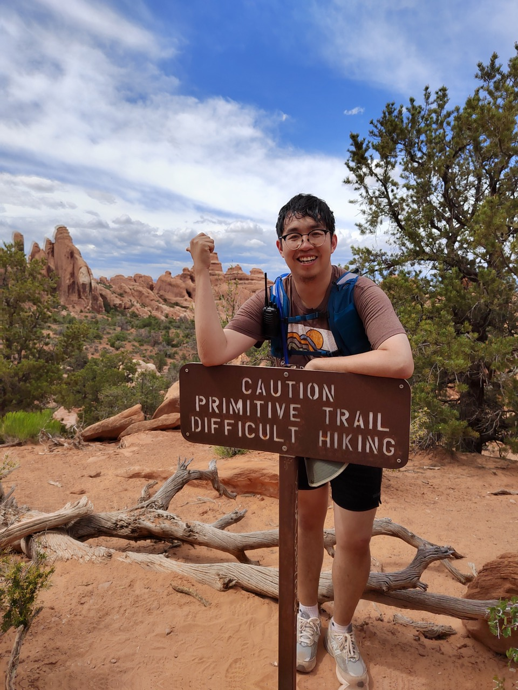

Miscellaneous
=============

Contact
-------
zhongjian dot wang at ntu dot edu dot sg

| SPMS-MAS-05-23
| 21 Nanyang Link, Singapore 637371

Beside Research and Teaching
----------------------------

* I am an amateur in playing soccer. I used to play for - math department in Tsinghua; Lapchee college, post graduate students association, Chinese students club in the University of Hong Kong; Chinese students club in the University of Chicago; various social team like, 2CFC, Sun Yat Sen Memorial Park Club in Hong Kong and Chinatown Club in Chicago; NTU Staff Team in Singapore.

* In the US, I like doing road trips, especially in the old-fashioned way. Most of my trips are related to hiking in the west. I hike near Chicago during weekends. Now moving to Singapore, I am open to finding a new group.

* I also started to spend some time on kayak, windsurfing and road bikes.

Useful Links
------------
`DMS at SPMS, NTU <https://www.ntu.edu.sg/spms/about-us/mathematics/>`_

`Stat Dept., UChicago <http://stat.uchicago.edu/>`_

`CCAM, UChicago <https://cam.uchicago.edu>`_

`Math Dept., HKU <https://hkumath.hku.hk/web/index.php>`_

`HKU Science <https://www.scifac.hku.hk/prospective/rpg/why-hku-science>`_

`HK PhD Fellowship <https://cerg1.ugc.edu.hk/hkpfs/index.html>`_

`Doris Chen Memorial Funds <https://hkumath.hku.hk/web/prize/recipients_dorischen.php>`_

`My ORCiD <https://orcid.org/0000-0002-5954-2483>`_

`My Google Scholar <https://scholar.google.com/citations?hl=en&user=XBdQFEsAAAAJ>`_

`<http://www.wangzhongjian.com>`_

